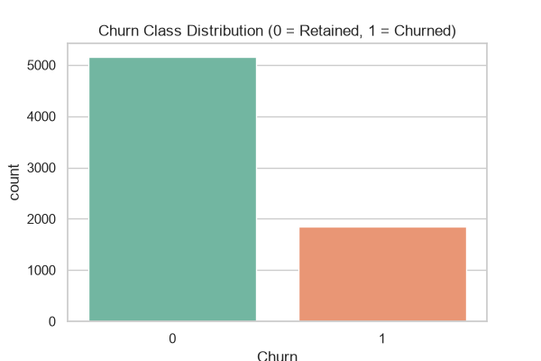
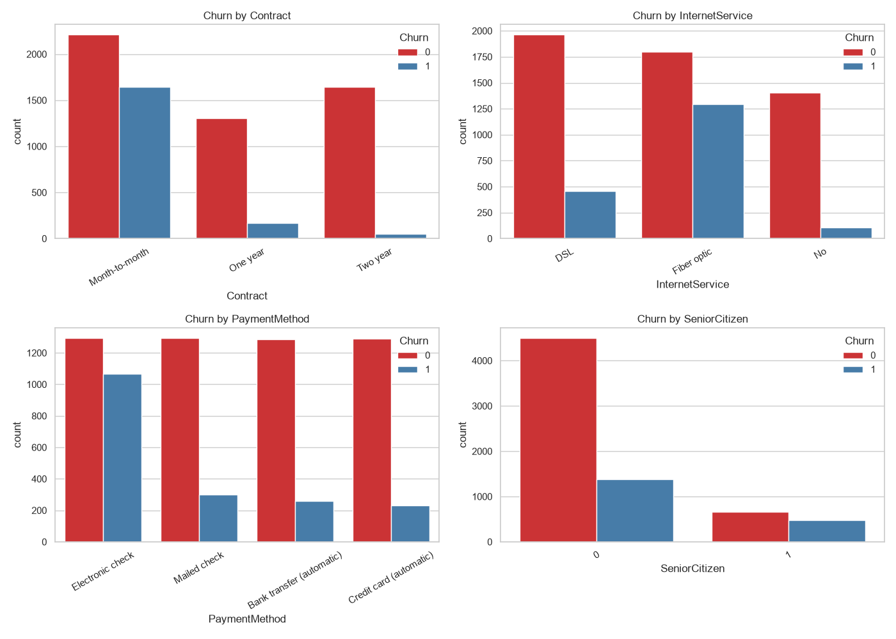
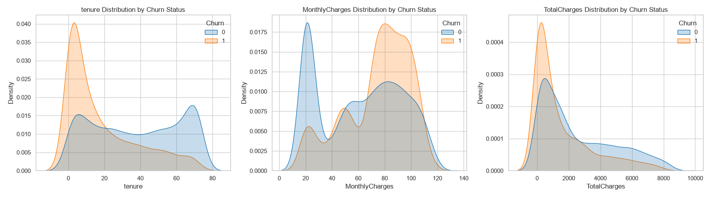

# Customer Churn Prediction System

An end-to-end Machine Learning project designed to predict telecom customer churn. The system includes data preprocessing, exploratory data analysis, model training and evaluation, hyperparameter tuning, and an interactive Streamlit web application for making real-time churn predictions.

---

## Features

* **Data Preprocessing:** Handles missing values and prepares categorical and numerical features for machine learning.
* **Machine Learning Pipeline:** Uses Scikit-Learn pipelines and `ColumnTransformer` for efficient data preprocessing and model training.
* **Data Leakage Prevention:** Ensures preprocessing transformations are fitted only on the training data.
* **Multiple Model Evaluation:** Compares several classification algorithms, including:

  * Logistic Regression
  * Decision Tree
  * Random Forest
  * K-Nearest Neighbors
  * Support Vector Machine
  * Gradient Boosting
* **Hyperparameter Tuning:** Uses `GridSearchCV` to optimize the best-performing model.
* **Model Evaluation:** Evaluates models using Accuracy, Precision, Recall, F1-Score, and ROC-AUC.
* **Exploratory Data Analysis:** Analyzes churn distribution and relationships between churn and categorical and numerical features.
* **Interactive Web Application:** Provides a Streamlit interface for real-time customer churn predictions.
* **Risk Assessment:** Categorizes customers based on their predicted churn probability.
* **Retention Recommendations:** Provides data-driven recommendations based on customer churn risk.

---

## Project Structure

```text
customer-churn-prediction/
│
├── data/
│   └── customer_churn.csv              # Dataset
│
├── notebooks/
│   └── churn_analysis.py               # Exploratory Data Analysis
│
├── src/
│   ├── __init__.py
│   ├── preprocessing.py                # Data preprocessing and pipeline creation
│   ├── train_model.py                  # Model training, tuning, and evaluation
│   └── predict.py                      # Prediction functions
│
├── models/
│   └── customer_churn_model.pkl        # Saved trained model
│
├── categorical_churn_analysis.png      # Categorical feature analysis
├── churn_distribution.png              # Customer churn distribution
├── numerical_churn_analysis.png        # Numerical feature analysis
├── app.py                              # Streamlit web application
├── requirements.txt                    # Project dependencies
└── README.md                           # Project documentation
```

---

## How to Run the Project

Follow the steps below to set up and run the project locally.

### 1. Clone the Repository

```bash
git clone <your-repository-url>
cd customer-churn-prediction
```

### 2. Create a Virtual Environment

**macOS/Linux:**

```bash
python -m venv venv
source venv/bin/activate
```

**Windows:**

```bash
python -m venv venv
venv\Scripts\activate
```

### 3. Install Dependencies

Install all required Python libraries:

```bash
pip install -r requirements.txt
```

### 4. Add the Dataset

Make sure the dataset file is placed inside the `data` folder:

```text
data/customer_churn.csv
```

### 5. Run Exploratory Data Analysis

To analyze the dataset and generate visualizations, run:

```bash
python notebooks/churn_analysis.py
```

This will generate the following analysis images:

* `churn_distribution.png`
* `categorical_churn_analysis.png`
* `numerical_churn_analysis.png`

### 6. Train the Model

Run the following command to preprocess the data, train and evaluate multiple machine learning models, perform hyperparameter tuning, and save the final model:

```bash
python -m src.train_model
```

After successful training, the final model will be saved at:

```text
models/customer_churn_model.pkl
```

### 7. Test Predictions from the Terminal

To test the prediction module, run:

```bash
python -m src.predict
```

### 8. Launch the Streamlit Application

Once the model has been trained successfully, start the web application:

```bash
streamlit run app.py
```

Streamlit will provide a local URL. Open the URL in your browser to access the application.

---

## Exploratory Data Analysis Results

The following visualizations provide insights into the customer churn dataset.

### Customer Churn Distribution

This visualization shows the distribution of customers who churned and those who remained with the company.



### Categorical Feature Analysis

This analysis examines the relationship between categorical customer features and churn.



### Numerical Feature Analysis

This visualization analyzes the relationship between numerical customer features and churn.



---

## Model Performance

The system evaluates multiple machine learning models and compares their performance using the following metrics:

* **Accuracy:** Measures the overall percentage of correct predictions.
* **Precision:** Measures how accurately the model identifies customers predicted to churn.
* **Recall:** Measures how effectively the model identifies actual customers who churn.
* **F1-Score:** Provides a balance between Precision and Recall.
* **ROC-AUC:** Measures the model's ability to distinguish between customers who churn and those who do not.

The best-performing model is selected based on the evaluation results. Hyperparameter tuning using `GridSearchCV` is then applied to improve the selected model's performance.

---

## Application Output

The Streamlit application allows users to enter customer information and receive:

* Customer churn prediction
* Probability of customer churn
* Customer churn risk level
* Data-driven retention recommendations

This enables businesses to identify customers who are likely to leave and take proactive actions to improve customer retention.

---

## Technologies Used

* **Python**
* **Pandas**
* **NumPy**
* **Scikit-Learn**
* **Streamlit**
* **Matplotlib**
* **Seaborn**
* **Joblib**

---

## Future Improvements

* Add batch predictions through CSV file uploads.
* Add more interactive data visualizations to the Streamlit dashboard.
* Implement feature importance analysis.
* Add model explainability using SHAP.
* Deploy the application to a cloud platform.
* Integrate a database for storing customer prediction history.
* Add automated model retraining when new customer data becomes available.

---

## Author

**Mugilarasan M.**

Aspiring AI Engineer | Machine Learning | Data Science
